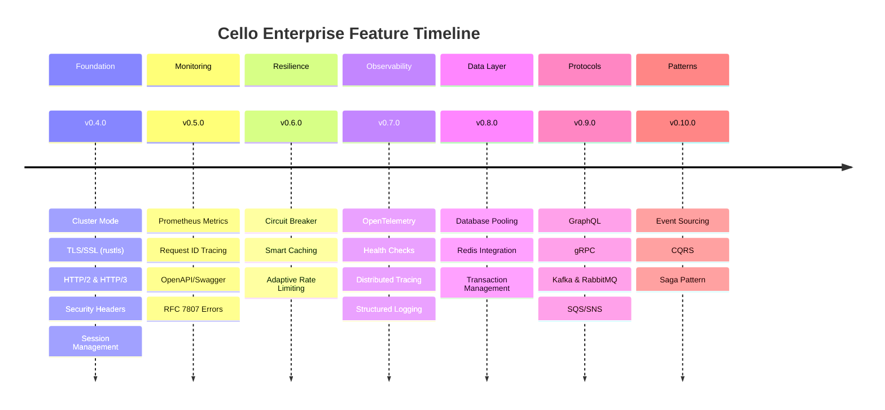

# :material-domain: Enterprise

<div class="grid" markdown>

!!! abstract ""

    **Build production-ready systems with confidence.** Cello's enterprise features deliver observability, integration, deployment tooling, and architectural patterns -- all implemented in Rust for maximum throughput and reliability at scale.

</div>

---

## :material-view-grid: Enterprise Capabilities

<div class="grid cards" markdown>

-   :material-chart-line:{ .lg .middle } **Observability**

    ---

    Full-stack visibility into your running services with distributed tracing, metrics collection, structured logging, and automated health checks.

    - :material-transit-connection-horizontal: OpenTelemetry integration
    - :material-chart-areaspline: Prometheus metrics endpoint
    - :material-identifier: UUID request ID tracing
    - :material-heart-pulse: Liveness, readiness & startup probes

    [:octicons-arrow-right-24: Observability](observability/opentelemetry.md)

-   :material-connection:{ .lg .middle } **Integration**

    ---

    Connect to databases, caches, message brokers, and multi-protocol APIs with async-first, pooled clients built in Rust.

    - :material-database: Async database connection pooling
    - :material-memory: Redis with Pub/Sub & cluster
    - :octicons-graph-16: GraphQL & gRPC support
    - :material-email-fast: Kafka, RabbitMQ & SQS adapters

    [:octicons-arrow-right-24: Integration](integration/database.md)

-   :material-cloud-upload:{ .lg .middle } **Deployment**

    ---

    Deploy anywhere with first-class support for containers, orchestrators, and service mesh architectures.

    - :material-docker: Optimized Docker images
    - :material-kubernetes: Kubernetes manifests & Helm charts
    - :material-hexagon-multiple: Service mesh (Istio/Linkerd)
    - :material-server-network: Cluster mode with multi-worker

    [:octicons-arrow-right-24: Deployment](deployment/docker.md)

-   :material-chart-timeline-variant-shimmer:{ .lg .middle } **Patterns**

    ---

    Battle-tested architectural patterns for building resilient, scalable distributed systems.

    - :material-history: Event Sourcing with snapshots
    - :material-call-split: CQRS command/query buses
    - :material-transit-connection-variant: Saga orchestration
    - :material-electric-switch: Circuit breaker fault tolerance

    [:octicons-arrow-right-24: Patterns](../learn/patterns/cqrs.md)

</div>

---

## :material-sitemap: Architecture Overview

```mermaid
graph TB
    subgraph Clients["Clients"]
        Browser["Browser / Mobile"]
        Service["Service-to-Service"]
        Queue["Message Queue"]
    end

    subgraph LB["Load Balancer / Ingress"]
        Ingress["Kubernetes Ingress<br/>or Reverse Proxy"]
    end

    subgraph Cello["Cello Application Cluster"]
        direction TB

        subgraph Worker1["Worker 1"]
            MW1["Middleware Pipeline"]
            RT1["Radix Router"]
            HN1["Handlers"]
        end

        subgraph Worker2["Worker 2"]
            MW2["Middleware Pipeline"]
            RT2["Radix Router"]
            HN2["Handlers"]
        end

        subgraph WorkerN["Worker N"]
            MWN["Middleware Pipeline"]
            RTN["Radix Router"]
            HNN["Handlers"]
        end

        subgraph Shared["Shared Components"]
            OTEL["OpenTelemetry<br/>Tracing & Metrics"]
            Health["Health Checks<br/>/health /ready /live"]
            Prom["Prometheus<br/>/metrics"]
        end
    end

    subgraph Data["Data Layer"]
        DB[("PostgreSQL<br/>Connection Pool")]
        Redis[("Redis<br/>Cache & Pub/Sub")]
        Kafka["Kafka / RabbitMQ<br/>Message Broker"]
    end

    subgraph Observability["Observability Stack"]
        Jaeger["Jaeger / Zipkin"]
        Grafana["Grafana"]
        AlertManager["AlertManager"]
    end

    Browser --> Ingress
    Service --> Ingress
    Queue --> Kafka

    Ingress --> Worker1
    Ingress --> Worker2
    Ingress --> WorkerN

    HN1 --> DB
    HN1 --> Redis
    HN1 --> Kafka
    HN2 --> DB
    HN2 --> Redis
    HNN --> DB
    HNN --> Redis

    OTEL --> Jaeger
    Prom --> Grafana
    Grafana --> AlertManager

    style Cello fill:#1a1a2e,stroke:#ff9100,stroke-width:2px
    style Data fill:#16213e,stroke:#ff9100,stroke-width:1px
    style Observability fill:#0f3460,stroke:#ff9100,stroke-width:1px
```



---

## :material-code-tags: Feature Highlights

=== ":material-transit-connection-horizontal: OpenTelemetry"

    ```python title="Distributed tracing with OpenTelemetry"
    from cello import App
    from cello.enterprise import OpenTelemetryConfig

    app = App(name="order-service")

    # Auto-instrument all routes with distributed tracing
    app.enable_telemetry(OpenTelemetryConfig(
        service_name="order-service",
        exporter="otlp",
        endpoint="http://jaeger:4317",
        sample_rate=0.1,  # Sample 10% of traces in production
        propagators=["tracecontext", "baggage"]
    ))

    @app.get("/orders/{id}")
    async def get_order(request):
        # Spans are auto-created for each request
        # Trace context propagates across service boundaries
        order = await db.fetch_one("SELECT * FROM orders WHERE id = $1",
                                   request.params["id"])
        return order
    ```

=== ":material-heart-pulse: Health Checks"

    ```python title="Kubernetes-ready health probes"
    from cello import App
    from cello.enterprise import HealthCheck

    app = App()

    # Register health checks for dependencies
    health = HealthCheck()
    health.add_check("database", check_database_connection)
    health.add_check("redis", check_redis_connection)
    health.add_check("kafka", check_kafka_connection)

    app.enable_health_checks(health)
    # GET /health  -> overall status
    # GET /ready   -> readiness (all checks pass)
    # GET /live    -> liveness (process is running)
    ```

=== ":material-database: Database Pooling"

    ```python title="Async connection pool with transactions"
    from cello import App
    from cello.enterprise import Database

    app = App()
    db = Database(
        url="postgresql://localhost/mydb",
        pool_size=20,
        max_overflow=10,
        pool_timeout=30,
        health_check_interval=60
    )

    @app.post("/orders")
    async def create_order(request):
        data = request.json()
        async with db.transaction() as tx:
            order = await tx.fetch_one(
                "INSERT INTO orders (user_id, total) VALUES ($1, $2) RETURNING *",
                data["user_id"], data["total"]
            )
            for item in data["items"]:
                await tx.execute(
                    "INSERT INTO order_items (order_id, product_id, qty) VALUES ($1, $2, $3)",
                    order["id"], item["product_id"], item["quantity"]
                )
        return {"order_id": order["id"], "status": "created"}
    ```

=== ":octicons-graph-16: GraphQL"

    ```python title="GraphQL with DataLoader"
    from cello import App
    from cello.enterprise import GraphQL, Schema

    app = App()

    schema = Schema()

    @schema.query("user")
    async def resolve_user(info, id: str):
        return await db.fetch_one("SELECT * FROM users WHERE id = $1", id)

    @schema.query("users")
    async def resolve_users(info, limit: int = 10):
        return await db.fetch_all("SELECT * FROM users LIMIT $1", limit)

    @schema.mutation("createUser")
    async def create_user(info, name: str, email: str):
        return await db.fetch_one(
            "INSERT INTO users (name, email) VALUES ($1, $2) RETURNING *",
            name, email
        )

    app.mount_graphql("/graphql", schema)
    ```

=== ":material-email-fast: Message Queues"

    ```python title="Kafka consumer with message routing"
    from cello import App
    from cello.enterprise import Kafka

    app = App()
    kafka = Kafka(brokers=["localhost:9092"])

    @kafka.consumer("orders.created", group="order-processor")
    async def handle_order_created(message):
        order = message.value
        # Process the order
        await send_confirmation_email(order["user_id"])
        await update_inventory(order["items"])

    @kafka.producer
    async def publish_event(topic, event):
        await kafka.send(topic, event)

    @app.post("/orders")
    async def create_order(request):
        order = request.json()
        saved = await db.save_order(order)
        await publish_event("orders.created", saved)
        return {"order_id": saved["id"]}
    ```

---

## :material-timeline: Enterprise Features by Version



---

## :material-check-all: Enterprise Feature Status

| Category | Feature | Status | Version |
|:---------|:--------|:------:|:--------|
| **Security** | JWT Authentication | :material-check-circle:{ style="color: #4caf50" } | v0.4.0 |
| | RBAC Guards | :material-check-circle:{ style="color: #4caf50" } | v0.5.0 |
| | Adaptive Rate Limiting | :material-check-circle:{ style="color: #4caf50" } | v0.6.0 |
| | Security Headers (CSP, HSTS) | :material-check-circle:{ style="color: #4caf50" } | v0.4.0 |
| | CSRF Protection | :material-check-circle:{ style="color: #4caf50" } | v0.4.0 |
| | Session Management | :material-check-circle:{ style="color: #4caf50" } | v0.4.0 |
| **Observability** | Prometheus Metrics | :material-check-circle:{ style="color: #4caf50" } | v0.5.0 |
| | Request ID Tracing | :material-check-circle:{ style="color: #4caf50" } | v0.4.0 |
| | OpenTelemetry | :material-check-circle:{ style="color: #4caf50" } | v0.7.0 |
| | Health Checks | :material-check-circle:{ style="color: #4caf50" } | v0.7.0 |
| **Scalability** | Cluster Mode | :material-check-circle:{ style="color: #4caf50" } | v0.4.0 |
| | HTTP/2 & HTTP/3 (QUIC) | :material-check-circle:{ style="color: #4caf50" } | v0.4.0 |
| | TLS/SSL (rustls) | :material-check-circle:{ style="color: #4caf50" } | v0.4.0 |
| | Circuit Breaker | :material-check-circle:{ style="color: #4caf50" } | v0.6.0 |
| **Integration** | Database Pooling | :material-check-circle:{ style="color: #4caf50" } | v0.8.0 |
| | Redis | :material-check-circle:{ style="color: #4caf50" } | v0.8.0 |
| | GraphQL | :material-check-circle:{ style="color: #4caf50" } | v0.9.0 |
| | gRPC | :material-check-circle:{ style="color: #4caf50" } | v0.9.0 |
| | Kafka, RabbitMQ, SQS | :material-check-circle:{ style="color: #4caf50" } | v0.9.0 |
| **Patterns** | Event Sourcing | :material-check-circle:{ style="color: #4caf50" } | v0.10.0 |
| | CQRS | :material-check-circle:{ style="color: #4caf50" } | v0.10.0 |
| | Saga Pattern | :material-check-circle:{ style="color: #4caf50" } | v0.10.0 |

---

## :material-book-open-variant: Enterprise Documentation

<div class="grid cards" markdown>

-   :material-chart-line:{ .lg .middle } **Observability**

    ---

    - [OpenTelemetry](observability/opentelemetry.md)
    - [Distributed Tracing](observability/tracing.md)
    - [Metrics](observability/metrics.md)
    - [Health Checks](observability/health-checks.md)

-   :material-connection:{ .lg .middle } **Integration**

    ---

    - [Database](integration/database.md)
    - [Message Queues](integration/message-queues.md)
    - [GraphQL](integration/graphql.md)
    - [gRPC](integration/grpc.md)

-   :material-cloud-upload:{ .lg .middle } **Deployment**

    ---

    - [Docker](deployment/docker.md)
    - [Kubernetes](deployment/kubernetes.md)
    - [Service Mesh](deployment/service-mesh.md)

-   :material-map:{ .lg .middle } **Roadmap**

    ---

    - [Enterprise Roadmap](roadmap.md)

</div>

---

## :material-handshake: Enterprise Support

!!! note "Enterprise Support & Consulting"

    For enterprise support, custom integrations, and consulting:

    - :material-email: **enterprise@cello-framework.dev**
    - :material-calendar: **[Schedule a Demo](https://calendly.com/cello-framework)**
    - :material-file-document: **[Enterprise Licensing](https://cello-framework.dev/enterprise)**
