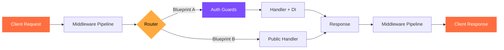

# :material-code-tags-check: Examples & Recipes

<div class="grid" markdown>

!!! example "Learn by doing"

    Every example below is a **complete, runnable application**. Clone the repo, pick a recipe, and have it running in seconds. Examples are organized by difficulty so you can progress at your own pace.

</div>

---

## :material-run-fast: Run an Example

Get any example running in under a minute.

```bash
# Clone the repository
git clone https://github.com/jagadeesh32/cello.git
cd cello

# Set up the environment
python -m venv .venv && source .venv/bin/activate
pip install -e .

# Run any example
python examples/hello.py
```

!!! tip "Live reload for development"

    Add `--reload` to automatically restart when you edit the file:

    ```bash
    python examples/hello.py --reload
    ```

---

## :material-school: Beginner

Start here if you are new to Cello. These examples cover the fundamentals with minimal code.

<div class="grid cards" markdown>

-   :material-hand-wave:{ .lg .middle } **Hello World**

    ---

    :material-star: Beginner  { .md-tag }

    The simplest possible Cello app -- one route, one response. Understand the core pattern that every Cello application follows.

    **Features used:** `App` `@app.get()` `dict response`

    ```python
    @app.get("/")
    def hello(request):
        return {"message": "Hello, World!"}
    ```

    [:octicons-arrow-right-24: Full Example](basic/hello-world.md)

-   :material-api:{ .lg .middle } **REST API**

    ---

    :material-star: Beginner  { .md-tag }

    Build a complete CRUD API with JSON validation, proper status codes, and error handling. The bread and butter of web development.

    **Features used:** `Blueprint` `Response.json()` `request.json()` `status codes`

    ```python
    @api.post("/users")
    def create_user(request):
        data = request.json()
        return Response.json(user, status=201)
    ```

    [:octicons-arrow-right-24: Full Example](basic/rest-api.md)

-   :material-form-textbox:{ .lg .middle } **Form Handling**

    ---

    :material-star: Beginner  { .md-tag }

    Accept form submissions and file uploads with multipart support. Covers both URL-encoded forms and file uploads.

    **Features used:** `request.form()` `multipart` `file uploads`

    ```python
    @app.post("/upload")
    def upload(request):
        file = request.files["document"]
        return {"filename": file.filename}
    ```

    [:octicons-arrow-right-24: Full Example](basic/forms.md)

</div>

---

## :material-rocket-launch: Intermediate

Ready to build real applications? These examples combine multiple Cello features into production-worthy patterns.

<div class="grid cards" markdown>

-   :material-application:{ .lg .middle } **Full-Stack App**

    ---

    :material-star::material-star: Intermediate  { .md-tag }

    A complete web application with HTML templates, static file serving, form handling, and database integration. Everything you need for a traditional web app.

    **Features used:** `Templates` `Static files` `Sessions` `Blueprints` `CSRF`

    [:octicons-arrow-right-24: Full Example](advanced/fullstack.md)

-   :material-server-network:{ .lg .middle } **Microservices**

    ---

    :material-star::material-star: Intermediate  { .md-tag }

    Break your application into independent services that communicate via HTTP and message queues. Includes service discovery and health checks.

    **Features used:** `gRPC` `Message queues` `Health checks` `Circuit breaker` `OpenTelemetry`

    [:octicons-arrow-right-24: Full Example](advanced/microservices.md)

-   :material-monitor-dashboard:{ .lg .middle } **Real-time Dashboard**

    ---

    :material-star::material-star: Intermediate  { .md-tag }

    Live-updating dashboard using WebSocket and Server-Sent Events. Push data to connected clients in real time with automatic reconnection.

    **Features used:** `WebSocket` `SSE` `Background tasks` `Prometheus metrics`

    [:octicons-arrow-right-24: Full Example](advanced/realtime-dashboard.md)

</div>

---

## :material-office-building:{ .lg } Enterprise

Battle-tested patterns for large-scale production systems. These examples demonstrate how Cello handles the complexity of enterprise software.

<div class="grid cards" markdown>

-   :material-domain:{ .lg .middle } **Multi-tenant SaaS**

    ---

    :material-star::material-star::material-star: Advanced  { .md-tag }

    Tenant isolation at the middleware level with per-tenant databases, RBAC, and custom domain routing. The foundation for any SaaS product.

    **Features used:** `Guards (RBAC)` `Middleware` `JWT` `Dependency injection` `Data partitioning`

    [:octicons-arrow-right-24: Full Example](enterprise/multi-tenant.md)

-   :material-gate:{ .lg .middle } **API Gateway**

    ---

    :material-star::material-star::material-star: Advanced  { .md-tag }

    A centralized API gateway with authentication, rate limiting, request transformation, and upstream load balancing. Control all traffic in one place.

    **Features used:** `Rate limiting` `JWT auth` `CORS` `Circuit breaker` `Prometheus` `Request ID tracing`

    [:octicons-arrow-right-24: Full Example](enterprise/api-gateway.md)

-   :material-swap-horizontal:{ .lg .middle } **Event Sourcing**

    ---

    :material-star::material-star::material-star: Advanced  { .md-tag }

    Event-driven architecture with CQRS, an append-only event store, and the Saga pattern for distributed transaction coordination.

    **Features used:** `Event store` `CQRS` `Saga pattern` `Background tasks` `Message queues`

    [:octicons-arrow-right-24: Full Example](enterprise/event-sourcing.md)

</div>

---

## :material-map: Example Architecture

How Cello's features layer together in a typical application.



---

## :material-compare: Feature Matrix

Which features are demonstrated in each example?

| Feature | Hello World | REST API | Forms | Full-Stack | Microservices | Dashboard | SaaS | Gateway | Events |
|:--------|:----------:|:--------:|:-----:|:----------:|:-------------:|:---------:|:----:|:-------:|:------:|
| Routing | :material-check: | :material-check: | :material-check: | :material-check: | :material-check: | :material-check: | :material-check: | :material-check: | :material-check: |
| Blueprints | | :material-check: | | :material-check: | :material-check: | :material-check: | :material-check: | :material-check: | :material-check: |
| Middleware | | :material-check: | | :material-check: | :material-check: | :material-check: | :material-check: | :material-check: | :material-check: |
| Guards / RBAC | | | | :material-check: | | | :material-check: | :material-check: | |
| JWT Auth | | | | :material-check: | :material-check: | | :material-check: | :material-check: | |
| WebSocket / SSE | | | | | | :material-check: | | | |
| Dependency Injection | | | | :material-check: | :material-check: | | :material-check: | | :material-check: |
| Background Tasks | | | | | :material-check: | :material-check: | | | :material-check: |
| Prometheus Metrics | | | | | :material-check: | :material-check: | | :material-check: | |

---

## :material-github: More Examples

Browse the full collection of examples in the [GitHub repository](https://github.com/jagadeesh32/cello/tree/main/examples). Contributions are welcome -- see the [Contributing Guide](../community/contributing.md) to add your own example.
