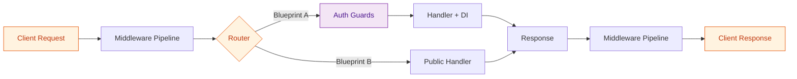

# :material-code-tags-check: Examples & Recipes

<div class="grid" markdown>

!!! example "Learn by doing"

    Every example below is a **complete, runnable application**. Clone the repo, pick a recipe, and have it running in seconds. Examples are organized by difficulty so you can progress at your own pace.

</div>

---

## :material-run-fast: Run an Example

Get any example running in under a minute.

```bash
# Clone the repository
git clone https://github.com/jagadeesh32/cello.git
cd cello

# Set up the environment
python -m venv .venv && source .venv/bin/activate
pip install -e .

# Run any example
python examples/hello.py
```

!!! tip "Live reload for development"

    Add `--reload` to automatically restart when you edit the file:

    ```bash
    python examples/hello.py --reload
    ```

---

## :material-school: Beginner

Start here if you are new to Cello. These examples cover the fundamentals with minimal code.

<div class="grid cards" markdown>

-   :material-hand-wave:{ .lg .middle } **Hello World**

    ---

    :material-star: Beginner  { .md-tag }

    The simplest possible Cello app — one route, one response. Understand the core pattern that every Cello application follows.

    **Features used:** `App` `@app.get()` `dict response`

    ```python
    @app.get("/")
    def hello(request):
        return {"message": "Hello, World!"}
    ```

    [:octicons-arrow-right-24: Full Example](basic/hello-world.md)

-   :material-api:{ .lg .middle } **REST API**

    ---

    :material-star: Beginner  { .md-tag }

    Build a complete CRUD API with JSON validation, proper status codes, and error handling. The bread and butter of web development.

    **Features used:** `Blueprint` `Response.json()` `request.json()` `status codes`

    ```python
    @api.post("/users")
    def create_user(request):
        data = request.json()
        return Response.json(user, status=201)
    ```

    [:octicons-arrow-right-24: Full Example](basic/rest-api.md)

-   :material-form-textbox:{ .lg .middle } **Form Handling**

    ---

    :material-star: Beginner  { .md-tag }

    Accept form submissions and file uploads with multipart support. Covers both URL-encoded forms and file uploads.

    **Features used:** `request.form()` `multipart` `file uploads`

    ```python
    @app.post("/upload")
    def upload(request):
        file = request.files["document"]
        return {"filename": file.filename}
    ```

    [:octicons-arrow-right-24: Full Example](basic/forms.md)

-   :material-lock:{ .lg .middle } **JWT Authentication**

    ---

    :material-star: Beginner  { .md-tag }

    Secure your routes with JSON Web Tokens. Covers token generation, verification, and protecting endpoints with a lightweight auth guard.

    **Features used:** `JWT` `Guards` `request.headers` `401 responses`

    ```python
    @app.get("/me")
    @requires_auth
    def profile(request):
        user = request.state.user
        return {"id": user.id, "email": user.email}
    ```

    [:octicons-arrow-right-24: Full Example](basic/jwt-auth.md)

-   :material-database:{ .lg .middle } **Database Integration**

    ---

    :material-star: Beginner  { .md-tag }

    Connect to SQLite or PostgreSQL using Cello's async DB helpers. Create tables, run queries, and map results to Python dicts with zero boilerplate.

    **Features used:** `async_db` `connection pool` `query helpers` `migrations`

    ```python
    @app.get("/products")
    async def list_products(request):
        rows = await db.fetch("SELECT * FROM products")
        return {"products": rows}
    ```

    [:octicons-arrow-right-24: Full Example](basic/database.md)

-   :material-send:{ .lg .middle } **Query Parameters & Validation**

    ---

    :material-star: Beginner  { .md-tag }

    Parse and validate URL query parameters with automatic type coercion, default values, and descriptive error messages on invalid input.

    **Features used:** `request.query` `validators` `400 error responses`

    ```python
    @app.get("/search")
    def search(request):
        q = request.query.get("q", "")
        page = int(request.query.get("page", 1))
        return {"query": q, "page": page}
    ```

    [:octicons-arrow-right-24: Full Example](basic/query-params.md)

</div>

---

## :material-rocket-launch: Intermediate

Ready to build real applications? These examples combine multiple Cello features into production-worthy patterns.

<div class="grid cards" markdown>

-   :material-application:{ .lg .middle } **Full-Stack App**

    ---

    :material-star::material-star: Intermediate  { .md-tag }

    A complete web application with HTML templates, static file serving, form handling, and database integration. Everything you need for a traditional web app.

    **Features used:** `Templates` `Static files` `Sessions` `Blueprints` `CSRF`

    [:octicons-arrow-right-24: Full Example](advanced/fullstack.md)

-   :material-server-network:{ .lg .middle } **Microservices**

    ---

    :material-star::material-star: Intermediate  { .md-tag }

    Break your application into independent services that communicate via HTTP and message queues. Includes service discovery and health checks.

    **Features used:** `gRPC` `Message queues` `Health checks` `Circuit breaker` `OpenTelemetry`

    [:octicons-arrow-right-24: Full Example](advanced/microservices.md)

-   :material-monitor-dashboard:{ .lg .middle } **Real-time Dashboard**

    ---

    :material-star::material-star: Intermediate  { .md-tag }

    Live-updating dashboard using WebSocket and Server-Sent Events. Push data to connected clients in real time with automatic reconnection.

    **Features used:** `WebSocket` `SSE` `Background tasks` `Prometheus metrics`

    [:octicons-arrow-right-24: Full Example](advanced/realtime-dashboard.md)

-   :material-cached:{ .lg .middle } **Redis Caching**

    ---

    :material-star::material-star: Intermediate  { .md-tag }

    Cache expensive query results in Redis with the cache-aside pattern. Covers TTL management, cache invalidation on writes, and cache warming strategies.

    **Features used:** `Redis middleware` `Caching` `TTL` `cache invalidation`

    ```python
    @app.get("/stats")
    @cache(ttl=60, backend="redis")
    async def get_stats(request):
        return await compute_heavy_stats()
    ```

    [:octicons-arrow-right-24: Full Example](advanced/redis-caching.md)

-   :material-lightning-bolt:{ .lg .middle } **Background Tasks**

    ---

    :material-star::material-star: Intermediate  { .md-tag }

    Offload slow work — emails, image processing, reports — to background workers. Covers task queues, retries, progress tracking, and scheduled cron jobs.

    **Features used:** `task_queue` `@background_task` `retry` `cron`

    ```python
    @app.post("/reports")
    async def generate_report(request):
        task = await queue.enqueue(build_report, request.json())
        return {"task_id": task.id, "status": "queued"}
    ```

    [:octicons-arrow-right-24: Full Example](advanced/background-tasks.md)

-   :material-transit-connection-variant:{ .lg .middle } **GraphQL API**

    ---

    :material-star::material-star: Intermediate  { .md-tag }

    Expose a fully-typed GraphQL schema alongside your REST routes. Demonstrates queries, mutations, subscriptions, and DataLoader for N+1 query prevention.

    **Features used:** `GraphQL` `schema` `resolvers` `DataLoader` `subscriptions`

    ```python
    @app.mount("/graphql")
    graphql_app = GraphQL(schema, context_value=get_context)
    ```

    [:octicons-arrow-right-24: Full Example](advanced/graphql.md)

-   :material-folder-upload:{ .lg .middle } **File Storage (S3-Compatible)**

    ---

    :material-star::material-star: Intermediate  { .md-tag }

    Upload, download, and stream files to S3-compatible object storage. Handles multipart uploads, pre-signed URLs, and chunked streaming responses.

    **Features used:** `multipart` `streaming response` `S3 client` `pre-signed URLs`

    ```python
    @app.post("/files")
    async def upload_file(request):
        url = await storage.upload(request.files["file"])
        return {"url": url}
    ```

    [:octicons-arrow-right-24: Full Example](advanced/file-storage.md)

</div>

---

## :material-office-building:{ .lg } Enterprise

Battle-tested patterns for large-scale production systems. These examples demonstrate how Cello handles the complexity of enterprise software.

<div class="grid cards" markdown>

-   :material-domain:{ .lg .middle } **Multi-tenant SaaS**

    ---

    :material-star::material-star::material-star: Advanced  { .md-tag }

    Tenant isolation at the middleware level with per-tenant databases, RBAC, and custom domain routing. The foundation for any SaaS product.

    **Features used:** `Guards (RBAC)` `Middleware` `JWT` `Dependency injection` `Data partitioning`

    [:octicons-arrow-right-24: Full Example](enterprise/multi-tenant.md)

-   :material-gate:{ .lg .middle } **API Gateway**

    ---

    :material-star::material-star::material-star: Advanced  { .md-tag }

    A centralized API gateway with authentication, rate limiting, request transformation, and upstream load balancing. Control all traffic in one place.

    **Features used:** `Rate limiting` `JWT auth` `CORS` `Circuit breaker` `Prometheus` `Request ID tracing`

    [:octicons-arrow-right-24: Full Example](enterprise/api-gateway.md)

-   :material-swap-horizontal:{ .lg .middle } **Event Sourcing**

    ---

    :material-star::material-star::material-star: Advanced  { .md-tag }

    Event-driven architecture with CQRS, an append-only event store, and the Saga pattern for distributed transaction coordination.

    **Features used:** `Event store` `CQRS` `Saga pattern` `Background tasks` `Message queues`

    [:octicons-arrow-right-24: Full Example](enterprise/event-sourcing.md)

-   :material-shield-check:{ .lg .middle } **Rate Limiting & DDoS Protection**

    ---

    :material-star::material-star::material-star: Advanced  { .md-tag }

    Protect your APIs with sliding-window rate limiting, IP allowlists/blocklists, adaptive throttling, and Prometheus alerting when thresholds are breached.

    **Features used:** `Rate limiting` `Redis` `IP filtering` `Prometheus` `Circuit breaker`

    ```python
    @app.middleware
    class RateLimiter:
        async def __call__(self, request, next):
            if await limiter.is_limited(request.ip):
                return Response.json({"error": "Too Many Requests"}, 429)
            return await next(request)
    ```

    [:octicons-arrow-right-24: Full Example](enterprise/rate-limiting.md)

-   :material-heart-pulse:{ .lg .middle } **Health Checks & Observability**

    ---

    :material-star::material-star::material-star: Advanced  { .md-tag }

    Production-ready `/health`, `/ready`, and `/metrics` endpoints. Integrates with Kubernetes liveness/readiness probes, OpenTelemetry tracing, and Grafana dashboards.

    **Features used:** `Health checks` `Prometheus` `OpenTelemetry` `Structured logging`

    ```python
    @app.get("/health")
    async def health(request):
        checks = await run_health_checks(db, redis, queue)
        status = "ok" if all(checks.values()) else "degraded"
        return {"status": status, "checks": checks}
    ```

    [:octicons-arrow-right-24: Full Example](enterprise/health-checks.md)

-   :material-account-group:{ .lg .middle } **OAuth2 & Social Login**

    ---

    :material-star::material-star::material-star: Advanced  { .md-tag }

    Complete OAuth2 authorization code flow with Google, GitHub, and custom providers. Covers PKCE, token refresh, session management, and account linking.

    **Features used:** `OAuth2` `JWT` `Sessions` `PKCE` `Token refresh`

    ```python
    @app.get("/auth/google/callback")
    async def google_callback(request):
        token = await oauth.google.authorize_access_token(request)
        user = await oauth.google.parse_id_token(request, token)
        return await login_or_create(user)
    ```

    [:octicons-arrow-right-24: Full Example](enterprise/oauth2.md)

</div>

---

## :material-map: Example Architecture

How Cello's features layer together in a typical application.


```mermaid
graph LR
    A[Client Request] --> B[Middleware Pipeline]
    B --> C{Router}
    C -->|Blueprint A| D[Auth Guards]
    C -->|Blueprint B| E[Public Handler]
    D --> F[Handler + DI]
    F --> G[Response]
    E --> G
    G --> H[Middleware Pipeline]
    H --> I[Client Response]

    style A fill:#FFF3E0,stroke:#E65100,color:#BF360C
    style I fill:#FFF3E0,stroke:#E65100,color:#BF360C
    style C fill:#FFF3E0,stroke:#E65100,color:#BF360C
    style D fill:#F3E5F5,stroke:#7B1FA2,color:#4A148C
```

---

## :material-compare: Feature Matrix

Which features are demonstrated in each example?

| Feature | Hello World | REST API | Forms | JWT Auth | Database | Query Params | Full-Stack | Microservices | Dashboard | Redis Cache | Background | GraphQL | File Storage | SaaS | Gateway | Events | Rate Limiting | Health | OAuth2 |
|:--------|:-----------:|:--------:|:-----:|:--------:|:--------:|:------------:|:----------:|:-------------:|:---------:|:-----------:|:----------:|:-------:|:------------:|:----:|:-------:|:------:|:-------------:|:------:|:------:|
| Routing | :material-check: | :material-check: | :material-check: | :material-check: | :material-check: | :material-check: | :material-check: | :material-check: | :material-check: | :material-check: | :material-check: | :material-check: | :material-check: | :material-check: | :material-check: | :material-check: | :material-check: | :material-check: | :material-check: |
| Blueprints | | :material-check: | | | | | :material-check: | :material-check: | :material-check: | | | | | :material-check: | :material-check: | :material-check: | | | :material-check: |
| Middleware | | :material-check: | | :material-check: | | | :material-check: | :material-check: | :material-check: | :material-check: | | | | :material-check: | :material-check: | :material-check: | :material-check: | :material-check: | :material-check: |
| Guards / RBAC | | | | :material-check: | | | :material-check: | | | | | | | :material-check: | :material-check: | | | | |
| JWT Auth | | | | :material-check: | | | :material-check: | :material-check: | | | | | | :material-check: | :material-check: | | | | :material-check: |
| WebSocket / SSE | | | | | | | | | :material-check: | | | | | | | | | | |
| Dependency Injection | | | | | | | :material-check: | :material-check: | | | | | | :material-check: | | :material-check: | | | |
| Background Tasks | | | | | | | | :material-check: | :material-check: | | :material-check: | | | | | :material-check: | | | |
| Prometheus Metrics | | | | | | | | :material-check: | :material-check: | | | | | | :material-check: | | :material-check: | :material-check: | |
| Redis / Caching | | | | | | | | | | :material-check: | | | | | | | :material-check: | :material-check: | |
| File Uploads | | | :material-check: | | | | :material-check: | | | | | | :material-check: | | | | | | |
| Database | | | | | :material-check: | | :material-check: | :material-check: | | | | :material-check: | | :material-check: | | :material-check: | | :material-check: | |
| OAuth2 / Sessions | | | | | | | :material-check: | | | | | | | :material-check: | | | | | :material-check: |

---

## :material-github: More Examples

Browse the full collection of examples in the [GitHub repository](https://github.com/jagadeesh32/cello/tree/main/examples). Contributions are welcome — see the [Contributing Guide](../community/contributing.md) to add your own example.
