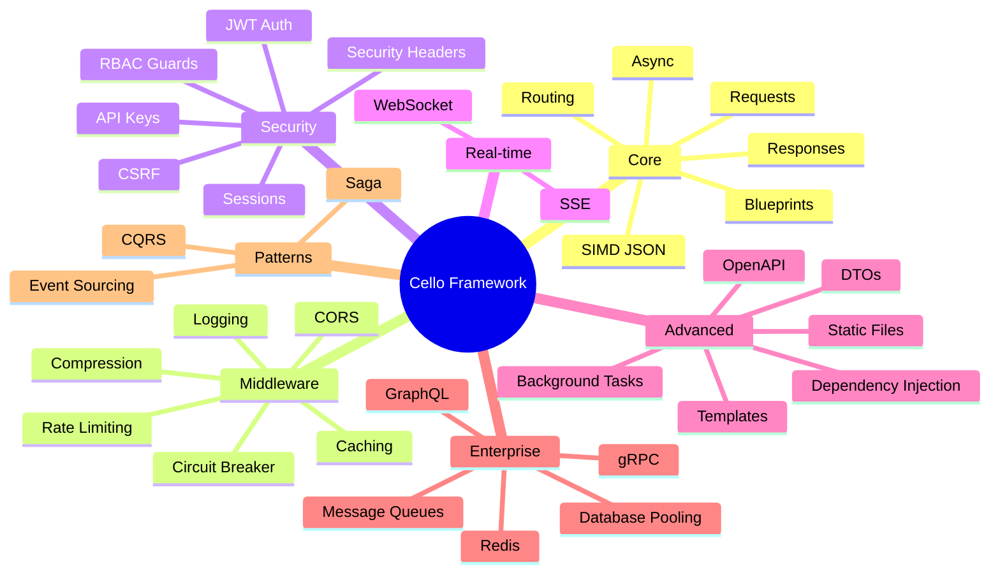

# :material-star-shooting: Features

<div class="grid" markdown>

!!! quote ""

    **Every feature in Cello is implemented in Rust for maximum performance.** From radix-tree routing to SIMD JSON parsing, Cello delivers C-level speed with a Python-native developer experience. Explore the full feature set below.

</div>

---

## :material-sitemap: Feature Overview



---

## :material-view-grid: Feature Categories

<div class="grid cards" markdown>

-   :material-routes:{ .lg .middle } **Core**

    ---

    The foundation of every Cello application -- high-performance routing, request/response handling, and async-first design.

    - :material-source-branch: Radix-tree routing (~100ns lookup)
    - :material-arrow-down-bold: Lazy body parsing & headers
    - :material-arrow-up-bold: JSON, HTML, streaming responses
    - :material-view-dashboard: Flask-like blueprints
    - :material-sync: Sync & async handlers
    - :material-lightning-bolt: SIMD-accelerated JSON

    [:octicons-arrow-right-24: Explore Core](core/routing.md)

    :material-tag: `v0.1.0`{ .md-tag }

-   :material-layers-triple:{ .lg .middle } **Middleware**

    ---

    A rich middleware suite built entirely in Rust with zero-allocation processing and composable pipelines.

    - :material-swap-horizontal: CORS handling
    - :material-archive-arrow-down: Gzip compression
    - :material-text-box-outline: Structured logging
    - :material-speedometer: Token bucket & sliding window rate limiting
    - :material-cached: Smart caching with TTL
    - :material-electric-switch: Circuit breaker fault tolerance

    [:octicons-arrow-right-24: Explore Middleware](middleware/overview.md)

    :material-tag: `v0.2.0 - v0.6.0`{ .md-tag }

-   :material-shield-lock:{ .lg .middle } **Security**

    ---

    Enterprise-grade security with constant-time operations and defense-in-depth architecture.

    - :material-key-variant: JWT, Basic & API Key auth
    - :material-account-lock: RBAC guards with composable roles
    - :material-cookie: Secure cookie sessions
    - :material-form-textbox-password: CSRF double-submit protection
    - :material-security: CSP, HSTS, X-Frame-Options
    - :material-shield-check: Constant-time token comparison

    [:octicons-arrow-right-24: Explore Security](security/overview.md)

    :material-tag: `v0.4.0 - v0.5.0`{ .md-tag }

-   :material-broadcast:{ .lg .middle } **Real-time**

    ---

    Bidirectional and server-push communication powered by Tokio's async runtime.

    - :material-lan-connect: WebSocket with message framing
    - :material-access-point: Server-Sent Events streaming
    - :material-account-group: Multi-client broadcasting
    - :material-heart-pulse: Connection health monitoring

    [:octicons-arrow-right-24: Explore Real-time](realtime/websocket.md)

    :material-tag: `v0.3.0`{ .md-tag }

-   :material-cog:{ .lg .middle } **Advanced**

    ---

    Power features for complex applications -- from dependency injection to auto-generated API documentation.

    - :material-needle: FastAPI-style dependency injection
    - :material-progress-clock: Post-response background tasks
    - :material-file-document-edit: Jinja2-compatible templates
    - :material-folder-open: Efficient static file serving
    - :material-upload: Multipart file uploads
    - :material-check-decagram: DTO validation & OpenAPI/Swagger

    [:octicons-arrow-right-24: Explore Advanced](advanced/dependency-injection.md)

    :material-tag: `v0.3.0 - v0.6.0`{ .md-tag }

-   :material-domain:{ .lg .middle } **Enterprise**

    ---

    Production-grade integrations for databases, caches, message queues, and multi-protocol APIs.

    - :material-database: Async connection pooling with health checks
    - :material-memory: Redis with Pub/Sub & cluster support
    - :octicons-graph-16: GraphQL queries, mutations & subscriptions
    - :material-api: gRPC with streaming support
    - :material-email-fast: Kafka, RabbitMQ & SQS adapters

    [:octicons-arrow-right-24: Explore Enterprise](../enterprise/index.md)

    :material-tag: `v0.8.0 - v0.9.0`{ .md-tag }

-   :material-history:{ .lg .middle } **Advanced Patterns**

    ---

    Battle-tested architectural patterns for building resilient distributed systems.

    - :material-history: Event Sourcing with aggregate roots & snapshots
    - :material-call-split: CQRS command/query separation
    - :material-transit-connection-variant: Saga pattern for distributed transactions
    - :material-replay: Event replay & compensation logic

    [:octicons-arrow-right-24: Explore Patterns](../learn/patterns/cqrs.md)

    :material-tag: `v0.10.0`{ .md-tag }

</div>

---

## :material-scale-balance: Feature Comparison

How does Cello stack up against popular Python web frameworks?

| Feature | 🎵 **Cello** | :material-lightning-bolt: FastAPI | :simple-flask: Flask | :simple-django: Django |
|:--------|:---:|:---:|:---:|:---:|
| **Rust-powered hot path** | :material-check-bold:{ style="color: #ff9100" } | :material-close: | :material-close: | :material-close: |
| **SIMD JSON parsing** | :material-check-bold:{ style="color: #ff9100" } | :material-close: | :material-close: | :material-close: |
| **Radix-tree routing** | :material-check-bold:{ style="color: #ff9100" } | :material-check: | :material-close: | :material-close: |
| **Async support** | :material-check-bold:{ style="color: #ff9100" } | :material-check: | :material-check:[^1] | :material-check:[^2] |
| **Dependency injection** | :material-check-bold:{ style="color: #ff9100" } | :material-check: | :material-close: | :material-close: |
| **Auto OpenAPI docs** | :material-check-bold:{ style="color: #ff9100" } | :material-check: | :material-close: | :material-close:[^3] |
| **WebSocket** | :material-check-bold:{ style="color: #ff9100" } | :material-check: | :material-close: | :material-check: |
| **Built-in JWT auth** | :material-check-bold:{ style="color: #ff9100" } | :material-close: | :material-close: | :material-close: |
| **RBAC guards** | :material-check-bold:{ style="color: #ff9100" } | :material-close: | :material-close: | :material-check: |
| **Rate limiting** | :material-check-bold:{ style="color: #ff9100" } | :material-close: | :material-close: | :material-close: |
| **Circuit breaker** | :material-check-bold:{ style="color: #ff9100" } | :material-close: | :material-close: | :material-close: |
| **HTTP/2 & HTTP/3** | :material-check-bold:{ style="color: #ff9100" } | :material-close: | :material-close: | :material-close: |
| **Cluster mode** | :material-check-bold:{ style="color: #ff9100" } | :material-close: | :material-close: | :material-close: |
| **GraphQL** | :material-check-bold:{ style="color: #ff9100" } | :material-close: | :material-close: | :material-close: |
| **gRPC** | :material-check-bold:{ style="color: #ff9100" } | :material-close: | :material-close: | :material-close: |

[^1]: Flask async support requires version 2.0+ with additional setup.
[^2]: Django async views require version 3.1+ and ASGI deployment.
[^3]: Django REST Framework provides OpenAPI via third-party packages.

---

## :material-code-tags: Quick Feature Tour

=== ":material-routes: Routing & DI"

    ```python title="Routing with dependency injection"
    from cello import App, Depends

    app = App()

    def get_db():
        return Database()

    @app.get("/users/{user_id}/posts/{post_id}")
    def get_post(request, db=Depends(get_db)):
        return {
            "user_id": request.params["user_id"],
            "post_id": request.params["post_id"],
            "posts": db.get_posts(request.params["user_id"])
        }
    ```

=== ":material-shield-lock: JWT Authentication"

    ```python title="JWT auth with protected routes"
    from cello import App
    from cello.middleware import JwtConfig, JwtAuth

    app = App()
    jwt_config = JwtConfig(secret=b"your-secret-key-min-32-bytes-long")
    app.use(JwtAuth(jwt_config))

    @app.get("/protected")
    def protected(request):
        claims = request.context.get("jwt_claims")
        return {"user": claims["sub"], "role": claims.get("role")}
    ```

=== ":material-broadcast: Real-time WebSocket"

    ```python title="WebSocket chat with broadcasting"
    from cello import App

    app = App()
    clients = set()

    @app.websocket("/ws/chat")
    def chat(ws):
        clients.add(ws)
        ws.send_text("Welcome!")
        try:
            while True:
                msg = ws.recv()
                if msg is None:
                    break
                for client in clients:
                    if client != ws:
                        client.send_text(f"User: {msg.text}")
        finally:
            clients.discard(ws)
    ```

=== ":material-speedometer: Rate Limiting"

    ```python title="Adaptive rate limiting"
    from cello import App
    from cello.middleware import AdaptiveRateLimitConfig

    app = App()

    # Adaptive: backs off under load
    app.enable_rate_limit(AdaptiveRateLimitConfig(
        base_requests=1000,
        window=60,
        cpu_threshold=0.8,
        memory_threshold=0.9,
        min_requests=100
    ))
    ```

=== ":material-database: Database & Redis"

    ```python title="Async database and Redis"
    from cello import App
    from cello.enterprise import Database, Redis

    app = App()
    db = Database("postgresql://localhost/mydb", pool_size=20)
    cache = Redis("redis://localhost:6379")

    @app.get("/users/{id}")
    async def get_user(request):
        user_id = request.params["id"]
        cached = await cache.get(f"user:{user_id}")
        if cached:
            return cached
        user = await db.fetch_one("SELECT * FROM users WHERE id = $1", user_id)
        await cache.set(f"user:{user_id}", user, ttl=300)
        return user
    ```

---

## :material-speedometer-medium: Performance Characteristics

All features are optimized at the Rust level for minimal overhead:

| Feature | Overhead | Implementation |
|:--------|:--------:|:---------------|
| **Routing** | ~100ns | Radix tree lookup via `matchit` |
| **JSON Parsing** | ~1us/KB | SIMD acceleration via `simd-json` |
| **JWT Validation** | ~50us | Constant-time comparison via `subtle` |
| **Rate Limiting** | ~100ns | Lock-free counters via `DashMap` |
| **Compression** | ~1us/KB | Native gzip in Rust |
| **Middleware Chain** | ~1us | Zero-allocation pipeline |
| **Session Lookup** | ~200ns | In-memory with `DashMap` |

---

## :material-tag-multiple: Version History

??? abstract "v0.1.0 -- Foundation"

    :material-routes: Routing | :material-arrow-down-bold: Request handling | :material-arrow-up-bold: Response types | :material-lightning-bolt: SIMD JSON | :material-sync: Async support

??? abstract "v0.2.0 -- Middleware Engine"

    :material-swap-horizontal: CORS | :material-archive-arrow-down: Compression | :material-text-box-outline: Logging | :material-view-dashboard: Blueprints

??? abstract "v0.3.0 -- Real-time & Uploads"

    :material-lan-connect: WebSocket | :material-access-point: SSE | :material-upload: Multipart uploads

??? abstract "v0.4.0 -- Security & Scale"

    :material-key-variant: JWT/Basic/API Key auth | :material-speedometer: Rate limiting | :material-cookie: Sessions | :material-security: Security headers | :material-server-network: Cluster mode | :material-lock: TLS/SSL | :material-protocol: HTTP/2 & HTTP/3

??? abstract "v0.5.0 -- Developer Experience"

    :material-needle: Dependency injection | :material-account-lock: RBAC guards | :material-chart-line: Prometheus metrics | :material-api: OpenAPI/Swagger | :material-progress-clock: Background tasks | :material-file-document-edit: Templates

??? abstract "v0.6.0 -- Smart Middleware"

    :material-cached: Smart caching with TTL | :material-speedometer: Adaptive rate limiting | :material-check-decagram: DTO validation | :material-electric-switch: Circuit breaker

??? abstract "v0.8.0 -- Data Layer"

    :material-database: Async database pooling | :material-memory: Redis integration | :material-swap-vert: Transaction management

??? abstract "v0.9.0 -- API Protocols"

    :octicons-graph-16: GraphQL | :material-api: gRPC | :material-email-fast: Kafka, RabbitMQ & SQS

??? abstract "v0.10.0 -- Advanced Patterns"

    :material-history: Event Sourcing | :material-call-split: CQRS | :material-transit-connection-variant: Saga pattern

---

## :material-arrow-right-bold: Next Steps

<div class="grid cards" markdown>

-   :material-routes:{ .lg .middle } **Core Features**

    ---

    Start with routing, requests, and responses

    [:octicons-arrow-right-24: Core](core/routing.md)

-   :material-layers-triple:{ .lg .middle } **Middleware**

    ---

    Add CORS, compression, rate limiting and more

    [:octicons-arrow-right-24: Middleware](middleware/overview.md)

-   :material-shield-lock:{ .lg .middle } **Security**

    ---

    Secure your app with JWT, guards, and headers

    [:octicons-arrow-right-24: Security](security/overview.md)

-   :material-broadcast:{ .lg .middle } **Real-time**

    ---

    Build with WebSocket and Server-Sent Events

    [:octicons-arrow-right-24: Real-time](realtime/websocket.md)

-   :material-cog:{ .lg .middle } **Advanced**

    ---

    Dependency injection, tasks, templates and DTOs

    [:octicons-arrow-right-24: Advanced](advanced/dependency-injection.md)

-   :material-domain:{ .lg .middle } **Enterprise**

    ---

    Database, Redis, GraphQL, gRPC, and more

    [:octicons-arrow-right-24: Enterprise](../enterprise/index.md)

</div>
