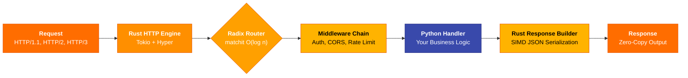

<style>
  /* Hide default title */
  .md-typeset h1 { display: none; }

  /* Hero section styling */
  .hero-section {
    text-align: center;
    padding: 2rem 1rem 1rem 1rem;
  }
  .hero-section .hero-title {
    font-size: 3.5rem;
    font-weight: 800;
    letter-spacing: -0.02em;
    margin-bottom: 0.25rem;
    background: linear-gradient(135deg, #ff6d00, #ff9100, #ffc107);
    -webkit-background-clip: text;
    -webkit-text-fill-color: transparent;
    background-clip: text;
    line-height: 1.1;
  }
  .hero-section .hero-tagline {
    font-size: 1.6rem;
    font-weight: 700;
    margin: 0.5rem 0 0.25rem 0;
    color: var(--md-default-fg-color);
  }
  .hero-section .hero-subtitle {
    font-size: 1.15rem;
    color: var(--md-default-fg-color--light);
    margin-bottom: 1.5rem;
  }
  .hero-badges {
    display: flex;
    gap: 0.5rem;
    justify-content: center;
    flex-wrap: wrap;
    margin-top: 1rem;
    margin-bottom: 0.5rem;
  }
  .hero-badges code {
    padding: 0.3em 0.8em;
    border-radius: 999px;
    font-size: 0.8rem;
    font-weight: 600;
  }
  .badge-version {
    background: linear-gradient(135deg, #ff6d00, #ff9100) !important;
    color: #fff !important;
  }
  .badge-tests {
    background: linear-gradient(135deg, #2e7d32, #4caf50) !important;
    color: #fff !important;
  }
  .badge-license {
    background: linear-gradient(135deg, #1565c0, #42a5f5) !important;
    color: #fff !important;
  }
  .badge-python {
    background: linear-gradient(135deg, #6a1b9a, #ab47bc) !important;
    color: #fff !important;
  }

  /* Performance banner */
  .perf-banner {
    text-align: center;
    padding: 1.5rem;
    margin: 1rem 0;
    border-radius: 12px;
    background: linear-gradient(135deg, rgba(255, 109, 0, 0.08), rgba(255, 193, 7, 0.08));
    border: 1px solid rgba(255, 145, 0, 0.25);
  }
  .perf-number {
    font-size: 3.2rem;
    font-weight: 900;
    background: linear-gradient(135deg, #ff6d00, #ffc107);
    -webkit-background-clip: text;
    -webkit-text-fill-color: transparent;
    background-clip: text;
    line-height: 1.2;
    margin-bottom: 0.25rem;
  }
  .perf-label {
    font-size: 1.1rem;
    font-weight: 600;
    color: var(--md-default-fg-color--light);
  }
  .perf-grid {
    display: grid;
    grid-template-columns: repeat(3, 1fr);
    gap: 1.5rem;
    margin-top: 1.5rem;
    text-align: center;
  }
  .perf-item {
    padding: 1rem;
    border-radius: 8px;
    background: var(--md-code-bg-color);
  }
  .perf-item .fw-name {
    font-weight: 700;
    font-size: 1rem;
    margin-bottom: 0.25rem;
  }
  .perf-item .fw-rps {
    font-size: 1.5rem;
    font-weight: 800;
  }
  .perf-item .fw-rps.cello-rps {
    color: #ff9100;
  }
  .perf-item .fw-rps.other-rps {
    color: var(--md-default-fg-color--light);
  }
  .perf-item .fw-detail {
    font-size: 0.8rem;
    color: var(--md-default-fg-color--lighter);
  }

  /* Architecture section */
  .arch-explain {
    text-align: center;
    max-width: 700px;
    margin: 0 auto;
    color: var(--md-default-fg-color--light);
    font-size: 1.05rem;
  }

  /* What's new banner */
  .whats-new-box {
    padding: 1.5rem 2rem;
    border-radius: 12px;
    background: linear-gradient(135deg, rgba(255, 109, 0, 0.06), rgba(156, 39, 176, 0.06));
    border: 1px solid rgba(255, 145, 0, 0.2);
    margin: 1rem 0;
  }
  .whats-new-box h3 {
    margin-top: 0;
  }

  /* Footer tagline */
  .footer-tagline {
    text-align: center;
    padding: 2rem 0 1rem 0;
    font-size: 1.1rem;
  }
  .footer-tagline .star-btn {
    margin-top: 1rem;
  }

  /* Responsive */
  @media screen and (max-width: 600px) {
    .hero-section .hero-title { font-size: 2.2rem; }
    .hero-section .hero-tagline { font-size: 1.2rem; }
    .perf-grid { grid-template-columns: 1fr; }
    .perf-number { font-size: 2.4rem; }
  }
</style>

<!-- ===== HERO SECTION ===== -->

# Cello Framework

<div class="hero-section" markdown>

<div class="hero-title">:fire: Cello Framework :rocket:</div>

<div class="hero-tagline">The World's Fastest Python Web Framework</div>

<div class="hero-subtitle">Rust-powered performance meets Python simplicity</div>

[:material-rocket-launch: Get Started](getting-started/index.md){ .md-button .md-button--primary .md-button--lg }
[:material-github: GitHub](https://github.com/jagadeesh32/cello){ .md-button }
[:material-package-variant: PyPI](https://pypi.org/project/cello-framework/){ .md-button }

<div class="hero-badges">
  <code class="badge-version">v0.10.0</code>
  <code class="badge-tests">372 tests passing</code>
  <code class="badge-license">MIT License</code>
  <code class="badge-python">Python 3.12+</code>
</div>

</div>

---

<!-- ===== PERFORMANCE BANNER ===== -->

<div class="perf-banner">
  <div class="perf-number">150,000+ req/sec</div>
  <div class="perf-label">Benchmarked on 4 cores / 8 GB RAM with wrk (12 threads, 400 connections)</div>

  <div class="perf-grid">
    <div class="perf-item">
      <div class="fw-name">:fire: Cello</div>
      <div class="fw-rps cello-rps">150,000+</div>
      <div class="fw-detail">p50 &lt;1ms &middot; p99 &lt;5ms</div>
    </div>
    <div class="perf-item">
      <div class="fw-name">FastAPI</div>
      <div class="fw-rps other-rps">30,000</div>
      <div class="fw-detail">p50 ~5ms &middot; p99 ~20ms</div>
    </div>
    <div class="perf-item">
      <div class="fw-name">Flask</div>
      <div class="fw-rps other-rps">5,000</div>
      <div class="fw-detail">p50 ~20ms &middot; p99 ~100ms</div>
    </div>
  </div>
</div>

---

<!-- ===== WHY CELLO ===== -->

## :zap: Why Cello?

<div class="grid cards" markdown>

-   :material-lightning-bolt:{ .lg .middle } **Blazing Fast**

    ---

    The entire hot path runs in **native Rust** -- SIMD JSON parsing, radix-tree routing, and middleware execution. Python only touches your business logic.

    [:octicons-arrow-right-24: Performance benchmarks](#performance-banner)

-   :material-shield-lock:{ .lg .middle } **Enterprise Security**

    ---

    Production-grade JWT authentication, RBAC guards, CSRF protection, rate limiting with sliding windows, and security headers with **constant-time comparison**.

    [:octicons-arrow-right-24: Security features](features/security/overview.md)

-   :material-access-point-network:{ .lg .middle } **Modern Protocols**

    ---

    First-class support for **HTTP/2**, **HTTP/3** (QUIC), **WebSocket**, and **Server-Sent Events** -- all powered by Rust's async runtime.

    [:octicons-arrow-right-24: Real-time features](features/realtime/websocket.md)

-   :material-puzzle:{ .lg .middle } **Developer Experience**

    ---

    FastAPI-style **dependency injection**, Flask-like **blueprints**, auto-generated **OpenAPI/Swagger** docs, and full **type hint** support.

    [:octicons-arrow-right-24: Quick start](getting-started/quickstart.md)

-   :material-graphql:{ .lg .middle } **API Protocols**

    ---

    Native **GraphQL** with subscriptions, **gRPC** with streaming, and message queue adapters for **Kafka**, **RabbitMQ**, and **SQS**.

    [:octicons-arrow-right-24: API protocols](enterprise/integration/graphql.md)

-   :material-source-branch:{ .lg .middle } **Advanced Patterns** :material-new-box:{ .lg }

    ---

    **Event Sourcing**, **CQRS**, and **Saga** orchestration built right into the framework. Enterprise architecture, zero boilerplate. _New in v0.10.0_.

    [:octicons-arrow-right-24: Event Sourcing](examples/enterprise/event-sourcing.md)

</div>

---

<!-- ===== QUICK START ===== -->

## :rocket: Quick Start

=== ":material-download: Installation"

    ```bash
    # Install from PyPI
    pip install cello-framework

    # Or with optional dependencies
    pip install cello-framework[graphql,grpc,kafka]

    # Verify installation
    python -c "import cello; print(cello.__version__)"
    ```

=== ":material-hand-wave: Hello World"

    ```python
    from cello import App

    app = App()

    @app.get("/")
    def home(request):
        return {"message": "Hello, Cello!"}

    @app.get("/users/{id}")
    def get_user(request):
        user_id = request.params["id"]
        return {"id": user_id, "name": "Alice"}

    if __name__ == "__main__":
        app.run()
    # => Cello running at http://127.0.0.1:8000
    ```

=== ":material-api: REST API"

    ```python
    from cello import App, Response, Blueprint
    from cello.guards import RoleGuard

    app = App()
    api = Blueprint("api", url_prefix="/api/v1")

    admin_only = RoleGuard(["admin"])

    @api.get("/users")
    def list_users(request):
        return {"users": [{"id": 1, "name": "Alice"}]}

    @api.post("/users", guards=[admin_only])
    def create_user(request):
        data = request.json()
        return Response.json({"created": True, **data}, status=201)

    @api.get("/users/{id}")
    def get_user(request):
        return {"id": request.params["id"]}

    app.register_blueprint(api)

    if __name__ == "__main__":
        app.run(port=8000, workers=4)
    ```

=== ":material-source-branch: Event Sourcing"

    ```python
    from cello import App
    from cello.eventsourcing import EventStore, Event, AggregateRoot

    app = App()
    store = EventStore()

    class OrderCreated(Event):
        order_id: str
        customer: str
        total: float

    class Order(AggregateRoot):
        def create(self, customer: str, total: float):
            self.apply(OrderCreated(
                order_id=self.id,
                customer=customer,
                total=total
            ))

        def on_order_created(self, event: OrderCreated):
            self.customer = event.customer
            self.total = event.total

    @app.post("/orders")
    async def create_order(request):
        data = request.json()
        order = Order()
        order.create(data["customer"], data["total"])
        await store.save(order)
        return {"order_id": order.id, "status": "created"}
    ```

---

<!-- ===== ARCHITECTURE ===== -->

## :building_construction: Architecture



<div class="arch-explain" markdown>

**Rust owns the hot path.** Every TCP connection, HTTP parse, route lookup, middleware check, and JSON serialization happens in native Rust. Python is invoked _only_ for your handler function -- then Rust takes over again to build and send the response. The result: **C-level throughput** with **Python-level simplicity**.

</div>

| Component | Technology | Why It Matters |
|-----------|------------|----------------|
| **HTTP Server** | Tokio + Hyper | Async I/O with zero Python overhead |
| **JSON Parsing** | simd-json | 10x faster than Python's `json` module |
| **Routing** | matchit (radix tree) | O(log n) lookup with compile-time optimization |
| **Middleware** | Pure Rust pipeline | No GIL contention, zero-copy data flow |
| **TLS** | rustls | Memory-safe TLS without OpenSSL |
| **WebSocket** | tokio-tungstenite | Native async WebSocket in Rust |

---

<!-- ===== FEATURE MATRIX ===== -->

## :bar_chart: Feature Comparison

How Cello stacks up against popular Python web frameworks:

| Feature | **Cello** | FastAPI | Flask | Django | Robyn |
|---------|:---------:|:-------:|:-----:|:------:|:-----:|
| **Requests/sec** | **150K+** | 30K | 5K | 8K | 100K |
| **Async Native** | :white_check_mark: | :white_check_mark: | :x: | :white_check_mark: | :white_check_mark: |
| **Rust Core** | :white_check_mark: | :x: | :x: | :x: | :white_check_mark: |
| **SIMD JSON** | :white_check_mark: | :x: | :x: | :x: | :x: |
| **WebSocket** | :white_check_mark: | :white_check_mark: | :x: | :white_check_mark: | :white_check_mark: |
| **HTTP/2** | :white_check_mark: | :white_check_mark: | :x: | :x: | :x: |
| **HTTP/3 (QUIC)** | :white_check_mark: | :x: | :x: | :x: | :x: |
| **SSE** | :white_check_mark: | :white_check_mark: | :x: | :x: | :x: |
| **GraphQL** | :white_check_mark: | :x: | :x: | :white_check_mark: | :x: |
| **gRPC** | :white_check_mark: | :x: | :x: | :x: | :x: |
| **Message Queues** | :white_check_mark: | :x: | :x: | :x: | :x: |
| **Dependency Injection** | :white_check_mark: | :white_check_mark: | :x: | :x: | :x: |
| **RBAC Guards** | :white_check_mark: | :x: | :x: | :white_check_mark: | :x: |
| **OpenAPI Auto-Gen** | :white_check_mark: | :white_check_mark: | :x: | :x: | :x: |
| **Event Sourcing** | :white_check_mark: | :x: | :x: | :x: | :x: |
| **CQRS** | :white_check_mark: | :x: | :x: | :x: | :x: |
| **Saga Pattern** | :white_check_mark: | :x: | :x: | :x: | :x: |

---

<!-- ===== TECH STACK ===== -->

## :package: Tech Stack

<div class="grid cards" markdown>

-   :material-language-rust:{ .lg .middle } **Rust Core**

    ---

    - **Tokio** -- async runtime
    - **Hyper** -- HTTP/1.1 & HTTP/2
    - **simd-json** -- hardware-accelerated JSON
    - **matchit** -- radix tree routing
    - **bumpalo** -- arena allocators

-   :material-language-python:{ .lg .middle } **Python API**

    ---

    - **PyO3** -- zero-overhead FFI
    - **abi3-py312** -- single binary for all versions
    - **Type hints** -- full IDE support
    - **Async/await** -- native coroutines
    - **Pydantic** -- optional validation

-   :material-shield-lock:{ .lg .middle } **Security**

    ---

    - **jsonwebtoken** -- JWT auth
    - **subtle** -- constant-time comparison
    - **rustls** -- memory-safe TLS
    - **hmac + sha2** -- hashing
    - **DashMap** -- lock-free concurrency

-   :material-server-network:{ .lg .middle } **Protocols**

    ---

    - **h2** -- HTTP/2 support
    - **quinn** -- HTTP/3 / QUIC
    - **tokio-tungstenite** -- WebSocket
    - **SSE** -- Server-Sent Events
    - **rustls** -- native HTTPS

-   :material-api:{ .lg .middle } **API & Messaging**

    ---

    - **async-graphql** -- GraphQL engine
    - **tonic** -- gRPC framework
    - **rdkafka** -- Apache Kafka
    - **lapin** -- RabbitMQ (AMQP)
    - **SQS** -- AWS message queue

</div>

---

<!-- ===== WHAT'S NEW ===== -->

## :sparkles: What's New in v0.10.0

<div class="whats-new-box" markdown>

!!! tip "v0.10.0 -- Advanced Architecture Patterns"

    The latest release brings enterprise-grade architecture patterns to Cello, all implemented in Rust for maximum performance:

    - :material-source-branch: **Event Sourcing** -- Append-only event stores with aggregate roots, snapshots, and full event replay. Build audit-complete systems with zero data loss.

    - :material-swap-horizontal: **CQRS (Command Query Responsibility Segregation)** -- Separate read and write models with automatic projection rebuilding. Scale reads and writes independently.

    - :material-chart-timeline: **Saga Pattern** -- Orchestrate distributed transactions across microservices with compensating actions, timeouts, and automatic rollback on failure.

    [:material-tag: Full Release Notes](releases/v0.10.0.md){ .md-button .md-button--primary }
    [:material-book-open-variant: Migration Guide](releases/migration.md){ .md-button }

</div>

---

<!-- ===== DOCUMENTATION SECTIONS ===== -->

## :book: Documentation

<div class="grid cards" markdown>

-   :material-rocket-launch:{ .lg .middle } **Getting Started**

    ---

    Installation, quick start guide, your first application, project structure, and configuration.

    [:octicons-arrow-right-24: Get started](getting-started/index.md)

-   :material-feature-search:{ .lg .middle } **Features**

    ---

    Routing, middleware, security, real-time, dependency injection, templates, and file uploads.

    [:octicons-arrow-right-24: Explore features](features/index.md)

-   :material-school:{ .lg .middle } **Learn**

    ---

    Step-by-step tutorials for REST APIs, chat apps, auth systems, and microservices.

    [:octicons-arrow-right-24: Tutorials & guides](learn/index.md)

-   :material-book-open-page-variant:{ .lg .middle } **API Reference**

    ---

    Complete API documentation for App, Request, Response, Blueprint, Middleware, Guards, and Context.

    [:octicons-arrow-right-24: Reference docs](reference/index.md)

-   :material-code-tags:{ .lg .middle } **Examples**

    ---

    Ready-to-run examples from hello world to full-stack apps, microservices, and event sourcing.

    [:octicons-arrow-right-24: Browse examples](examples/index.md)

-   :material-office-building:{ .lg .middle } **Enterprise**

    ---

    OpenTelemetry, GraphQL, gRPC, message queues, Docker, Kubernetes, and service mesh deployment.

    [:octicons-arrow-right-24: Enterprise docs](enterprise/index.md)

</div>

---

<!-- ===== COMMUNITY ===== -->

## :handshake: Community & Contributing

We welcome contributions of all kinds. Whether it is a bug report, feature request, documentation improvement, or code contribution -- every bit helps.

<div class="grid cards" markdown>

-   :material-bug:{ .lg .middle } **Report Issues**

    ---

    Found a bug or have a feature request? Open an issue on GitHub and help us improve Cello.

    [:octicons-issue-opened-24: Open an Issue](https://github.com/jagadeesh32/cello/issues){ .md-button }

-   :material-source-pull:{ .lg .middle } **Submit Pull Requests**

    ---

    Want to contribute code? Check out the contributing guide, pick an issue, and submit a PR.

    [:octicons-git-pull-request-24: Contributing Guide](community/contributing.md){ .md-button }

-   :material-chat:{ .lg .middle } **Join the Community**

    ---

    Questions, ideas, or just want to chat? Join our Discord server and connect with other developers.

    [:material-discord: Join Discord](https://discord.gg/cello){ .md-button }

</div>

---

<!-- ===== FOOTER TAGLINE ===== -->

<div class="footer-tagline" markdown>

**Made with :snake: Python and :crab: Rust**

Designed for developers who refuse to compromise between performance and productivity.

<div class="star-btn" markdown>

[:material-star: Star on GitHub](https://github.com/jagadeesh32/cello){ .md-button .md-button--primary }
[:material-tag: Release Notes](releases/index.md){ .md-button }

</div>

</div>
