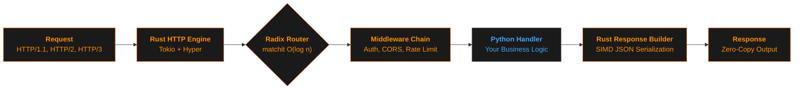

<style>.md-typeset h1 { display: none; }</style>

<!-- ===== HERO SECTION ===== -->

# Cello Framework

<div class="hero-section" markdown>

<div class="hero-logo">
  
</div>

<div class="hero-title">🔥 Cello Framework 🚀</div>

<div class="hero-tagline">Ultra-Fast Python Web Framework</div>

<div class="hero-subtitle">Rust-powered performance meets Python simplicity</div>

[:material-rocket-launch: Get Started](getting-started/index.md){ .md-button .md-button--primary .md-button--lg }
[:material-github: GitHub](https://github.com/jagadeesh32/cello){ .md-button }
[:material-package-variant: PyPI](https://pypi.org/project/cello-framework/){ .md-button }

<div class="hero-badges">
  <code class="badge-version">v1.0.1</code>
  <code class="badge-tests">394 tests passing</code>
  <code class="badge-license">MIT License</code>
  <code class="badge-python">Python 3.12+</code>
</div>

</div>

---

<!-- ===== PERFORMANCE BANNER ===== -->

<div class="perf-banner" id="performance-banner">
  <div class="perf-number">170,000+ req/sec</div>
  <div class="perf-label">Benchmarked with 4 workers (5 processes) &middot; wrk (12 threads, 400 connections, 10s)</div>

  <div class="perf-grid">
    <div class="perf-item">
      <div class="fw-name">🔥 Cello</div>
      <div class="fw-rps cello-rps">170,000+</div>
      <div class="fw-detail">avg 2.8ms &middot; p99 15ms</div>
    </div>
    <div class="perf-item">
      <div class="fw-name">BlackSheep + Granian</div>
      <div class="fw-rps other-rps">92,000</div>
      <div class="fw-detail">avg 4.3ms &middot; p99 13ms</div>
    </div>
    <div class="perf-item">
      <div class="fw-name">FastAPI + Granian</div>
      <div class="fw-rps other-rps">55,000</div>
      <div class="fw-detail">avg 7.1ms &middot; p99 17ms</div>
    </div>
    <div class="perf-item">
      <div class="fw-name">Robyn</div>
      <div class="fw-rps other-rps">29,000</div>
      <div class="fw-detail">avg 14.2ms &middot; p99 38ms</div>
    </div>
  </div>
</div>

---

<!-- ===== WHY CELLO ===== -->

## :material-lightning-bolt: Why Cello?

<div class="grid cards" markdown>

-   :material-lightning-bolt:{ .lg .middle } **Blazing Fast**

    ---

    The entire hot path runs in **native Rust** -- SIMD JSON parsing, radix-tree routing, and middleware execution. Python only touches your business logic.

    [:octicons-arrow-right-24: Performance benchmarks](#performance-banner)

-   :material-shield-lock:{ .lg .middle } **Enterprise Security**

    ---

    Production-grade JWT authentication, RBAC guards, CSRF protection, rate limiting with sliding windows, and security headers with **constant-time comparison**.

    [:octicons-arrow-right-24: Security features](features/security/overview.md)

-   :material-access-point-network:{ .lg .middle } **Modern Protocols**

    ---

    First-class support for **HTTP/2**, **HTTP/3** (QUIC), **WebSocket**, and **Server-Sent Events** -- all powered by Rust's async runtime.

    [:octicons-arrow-right-24: Real-time features](features/realtime/websocket.md)

-   :material-puzzle:{ .lg .middle } **Developer Experience**

    ---

    FastAPI-style **dependency injection**, Flask-like **blueprints**, auto-generated **OpenAPI/Swagger** docs, and full **type hint** support.

    [:octicons-arrow-right-24: Quick start](getting-started/quickstart.md)

-   :material-graphql:{ .lg .middle } **API Protocols**

    ---

    Native **GraphQL** with subscriptions, **gRPC** with streaming, and message queue adapters for **Kafka**, **RabbitMQ**, and **SQS**.

    [:octicons-arrow-right-24: API protocols](enterprise/integration/graphql.md)

-   :material-source-branch:{ .lg .middle } **Advanced Patterns** :material-new-box:{ .lg }

    ---

    **Event Sourcing**, **CQRS**, and **Saga** orchestration built right into the framework. Enterprise architecture, zero boilerplate. _Stable in v1.0.1_.

    [:octicons-arrow-right-24: Event Sourcing](examples/enterprise/event-sourcing.md)

</div>

---

<!-- ===== QUICK START ===== -->

## :material-rocket-launch: Quick Start

=== ":material-download: Installation"

    ```bash
    # Install from PyPI
    pip install cello-framework

    # Or with optional dependencies
    pip install cello-framework[graphql,grpc,kafka]

    # Verify installation
    python -c "import cello; print(cello.__version__)"
    ```

=== ":material-hand-wave: Hello World"

    ```python
    from cello import App

    app = App()

    @app.get("/")
    def home(request):
        return {"message": "Hello, Cello!"}

    @app.get("/users/{id}")
    def get_user(request):
        user_id = request.params["id"]
        return {"id": user_id, "name": "Alice"}

    if __name__ == "__main__":
        app.run()
    # => Cello running at http://127.0.0.1:8000
    ```

=== ":material-api: REST API"

    ```python
    from cello import App, Response, Blueprint
    from cello.guards import RoleGuard

    app = App()
    api = Blueprint("api", url_prefix="/api/v1")

    admin_only = RoleGuard(["admin"])

    @api.get("/users")
    def list_users(request):
        return {"users": [{"id": 1, "name": "Alice"}]}

    @api.post("/users", guards=[admin_only])
    def create_user(request):
        data = request.json()
        return Response.json({"created": True, **data}, status=201)

    @api.get("/users/{id}")
    def get_user(request):
        return {"id": request.params["id"]}

    app.register_blueprint(api)

    if __name__ == "__main__":
        app.run(port=8000, workers=4)
    ```

=== ":material-source-branch: Event Sourcing"

    ```python
    from cello import App
    from cello.eventsourcing import EventStore, Event, AggregateRoot

    app = App()
    store = EventStore()

    class OrderCreated(Event):
        order_id: str
        customer: str
        total: float

    class Order(AggregateRoot):
        def create(self, customer: str, total: float):
            self.apply(OrderCreated(
                order_id=self.id,
                customer=customer,
                total=total
            ))

        def on_order_created(self, event: OrderCreated):
            self.customer = event.customer
            self.total = event.total

    @app.post("/orders")
    async def create_order(request):
        data = request.json()
        order = Order()
        order.create(data["customer"], data["total"])
        await store.save(order)
        return {"order_id": order.id, "status": "created"}
    ```

---

<!-- ===== ARCHITECTURE ===== -->

## :material-hammer-wrench: Architecture



<div class="arch-explain" markdown>

**Rust owns the hot path.** Every TCP connection, HTTP parse, route lookup, middleware check, and JSON serialization happens in native Rust. Python is invoked _only_ for your handler function -- then Rust takes over again to build and send the response. The result: **C-level throughput** with **Python-level simplicity**.

</div>

| Component | Technology | Why It Matters |
|-----------|------------|----------------|
| **HTTP Server** | Tokio + Hyper | Async I/O with zero Python overhead |
| **JSON Parsing** | simd-json | 10x faster than Python's `json` module |
| **Routing** | matchit (radix tree) | O(log n) lookup with compile-time optimization |
| **Middleware** | Pure Rust pipeline | No GIL contention, zero-copy data flow |
| **TLS** | rustls | Memory-safe TLS without OpenSSL |
| **WebSocket** | tokio-tungstenite | Native async WebSocket in Rust |

---

<!-- ===== FEATURE MATRIX ===== -->

## :material-chart-bar: Feature Comparison

How Cello stacks up against popular Python web frameworks (4 workers, 5 processes each, wrk 12t/400c/10s):

| Feature | **Cello** | BlackSheep+Granian | FastAPI+Granian | Robyn |
|---------|:---------:|:------------------:|:---------------:|:-----:|
| **Requests/sec** | **170K+** | 92K | 55K | 29K |
| **Async Native** | :material-check-circle: | :material-check-circle: | :material-check-circle: | :material-check-circle: |
| **Rust Core** | :material-check-circle: | :material-check-circle: | :material-check-circle: | :material-check-circle: |
| **SIMD JSON** | :material-check-circle: | :material-close-circle: | :material-close-circle: | :material-close-circle: |
| **WebSocket** | :material-check-circle: | :material-check-circle: | :material-check-circle: | :material-check-circle: |
| **HTTP/2** | :material-check-circle: | :material-check-circle: | :material-check-circle: | :material-close-circle: |
| **HTTP/3 (QUIC)** | :material-check-circle: | :material-close-circle: | :material-close-circle: | :material-close-circle: |
| **SSE** | :material-check-circle: | :material-check-circle: | :material-check-circle: | :material-close-circle: |
| **GraphQL** | :material-check-circle: | :material-close-circle: | :material-close-circle: | :material-close-circle: |
| **gRPC** | :material-check-circle: | :material-close-circle: | :material-close-circle: | :material-close-circle: |
| **Message Queues** | :material-check-circle: | :material-close-circle: | :material-close-circle: | :material-close-circle: |
| **Dependency Injection** | :material-check-circle: | :material-close-circle: | :material-check-circle: | :material-close-circle: |
| **RBAC Guards** | :material-check-circle: | :material-close-circle: | :material-close-circle: | :material-close-circle: |
| **OpenAPI Auto-Gen** | :material-check-circle: | :material-close-circle: | :material-check-circle: | :material-check-circle: |
| **Event Sourcing** | :material-check-circle: | :material-close-circle: | :material-close-circle: | :material-close-circle: |
| **CQRS** | :material-check-circle: | :material-close-circle: | :material-close-circle: | :material-close-circle: |
| **Saga Pattern** | :material-check-circle: | :material-close-circle: | :material-close-circle: | :material-close-circle: |

---

<!-- ===== TECH STACK ===== -->

## :material-package-variant: Tech Stack

<div class="grid cards" markdown>

-   :material-language-rust:{ .lg .middle } **Rust Core**

    ---

    - **Tokio** -- async runtime
    - **Hyper** -- HTTP/1.1 & HTTP/2
    - **simd-json** -- hardware-accelerated JSON
    - **matchit** -- radix tree routing
    - **bumpalo** -- arena allocators

-   :material-language-python:{ .lg .middle } **Python API**

    ---

    - **PyO3** -- zero-overhead FFI
    - **abi3-py312** -- single binary for all versions
    - **Type hints** -- full IDE support
    - **Async/await** -- native coroutines
    - **Pydantic** -- optional validation

-   :material-shield-lock:{ .lg .middle } **Security**

    ---

    - **jsonwebtoken** -- JWT auth
    - **subtle** -- constant-time comparison
    - **rustls** -- memory-safe TLS
    - **hmac + sha2** -- hashing
    - **DashMap** -- lock-free concurrency

-   :material-server-network:{ .lg .middle } **Protocols**

    ---

    - **h2** -- HTTP/2 support
    - **quinn** -- HTTP/3 / QUIC
    - **tokio-tungstenite** -- WebSocket
    - **SSE** -- Server-Sent Events
    - **rustls** -- native HTTPS

-   :material-api:{ .lg .middle } **API & Messaging**

    ---

    - **async-graphql** -- GraphQL engine
    - **tonic** -- gRPC framework
    - **rdkafka** -- Apache Kafka
    - **lapin** -- RabbitMQ (AMQP)
    - **SQS** -- AWS message queue

</div>

---

<!-- ===== WHAT'S NEW ===== -->

## :material-creation: What's New in v1.0.1

<div class="whats-new-box" markdown>

!!! tip "v1.0.1 -- Production Ready"

    Cello reaches **stable release** with a complete feature set, major performance optimizations, and a semantic versioning commitment. The API is now frozen -- no breaking changes until v2.0.

    - :material-rocket-launch: **Production Stable** -- Battle-tested API with semantic versioning guarantees. Ready for enterprise deployments.

    - :material-speedometer: **Performance Optimizations** -- Handler metadata caching, lazy body parsing, zero-copy responses, TCP_NODELAY, and optimized release builds deliver peak throughput.

    - :material-feature-search: **Complete Feature Set** -- Routing, middleware, auth, WebSocket, SSE, DI, guards, caching, rate limiting, OpenTelemetry, GraphQL, gRPC, Event Sourcing, CQRS, and Saga patterns -- all in one framework.

    [:material-tag: Full Release Notes](releases/v1.0.1.md){ .md-button .md-button--primary }
    [:material-book-open-variant: Migration Guide](releases/migration.md){ .md-button }

</div>

---

<!-- ===== DOCUMENTATION SECTIONS ===== -->

## :material-book-open-variant: Documentation

<div class="grid cards" markdown>

-   :material-rocket-launch:{ .lg .middle } **Getting Started**

    ---

    Installation, quick start guide, your first application, project structure, and configuration.

    [:octicons-arrow-right-24: Get started](getting-started/index.md)

-   :material-feature-search:{ .lg .middle } **Features**

    ---

    Routing, middleware, security, real-time, dependency injection, templates, and file uploads.

    [:octicons-arrow-right-24: Explore features](features/index.md)

-   :material-school:{ .lg .middle } **Learn**

    ---

    Step-by-step tutorials for REST APIs, chat apps, auth systems, and microservices.

    [:octicons-arrow-right-24: Tutorials & guides](learn/index.md)

-   :material-book-open-page-variant:{ .lg .middle } **API Reference**

    ---

    Complete API documentation for App, Request, Response, Blueprint, Middleware, Guards, and Context.

    [:octicons-arrow-right-24: Reference docs](reference/index.md)

-   :material-code-tags:{ .lg .middle } **Examples**

    ---

    Ready-to-run examples from hello world to full-stack apps, microservices, and event sourcing.

    [:octicons-arrow-right-24: Browse examples](examples/index.md)

-   :material-office-building:{ .lg .middle } **Enterprise**

    ---

    OpenTelemetry, GraphQL, gRPC, message queues, Docker, Kubernetes, and service mesh deployment.

    [:octicons-arrow-right-24: Enterprise docs](enterprise/index.md)

</div>

---

<!-- ===== COMMUNITY ===== -->

## :material-handshake: Community & Contributing

We welcome contributions of all kinds. Whether it is a bug report, feature request, documentation improvement, or code contribution -- every bit helps.

<div class="grid cards" markdown>

-   :material-bug:{ .lg .middle } **Report Issues**

    ---

    Found a bug or have a feature request? Open an issue on GitHub and help us improve Cello.

    [:octicons-issue-opened-24: Open an Issue](https://github.com/jagadeesh32/cello/issues){ .md-button }

-   :material-source-pull:{ .lg .middle } **Submit Pull Requests**

    ---

    Want to contribute code? Check out the contributing guide, pick an issue, and submit a PR.

    [:octicons-git-pull-request-24: Contributing Guide](community/contributing.md){ .md-button }

-   :material-chat:{ .lg .middle } **Join the Community**

    ---

    Questions, ideas, or just want to chat? Join our Discord server and connect with other developers.

    [:material-discord: Join Discord](https://discord.gg/cello){ .md-button }

</div>

---

<!-- ===== FOOTER TAGLINE ===== -->

<div class="footer-tagline" markdown>

**Made with 🐍 Python and 🦀 Rust**

Designed for developers who refuse to compromise between performance and productivity.

<div class="star-btn" markdown>

[:material-star: Star on GitHub](https://github.com/jagadeesh32/cello){ .md-button .md-button--primary }
[:material-tag: Release Notes](releases/index.md){ .md-button }

</div>

</div>
