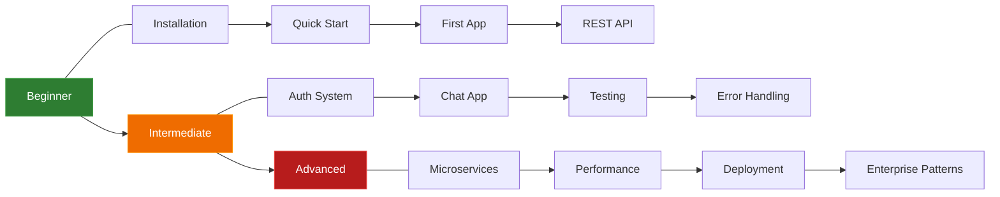

# :material-school: Learn Cello

!!! quote ""

    **Master Cello through hands-on learning.** Whether you're writing your first route or architecting distributed systems, there's a guided path for you. Pick your level and start building.

---

## :material-road-variant: Learning Path

Follow the progression from beginner to advanced to build your skills step by step:

-   :material-sprout:{ .lg .middle } **Beginner**

    ---

    New to Cello? Start here with the fundamentals. Learn installation, routing, request handling, and build your first REST API.

    **Estimated time:** 2-3 hours

    1. [:octicons-arrow-right-24: Installation](../getting-started/installation.md)
    2. [:octicons-arrow-right-24: Quick Start](../getting-started/quickstart.md)
    3. [:octicons-arrow-right-24: First Application](../getting-started/first-app.md)
    4. [:octicons-arrow-right-24: Build a REST API](tutorials/rest-api.md)

-   :material-fire:{ .lg .middle } **Intermediate**

    ---

    Ready for more? Learn authentication, real-time communication, testing strategies, and robust error handling.

    **Estimated time:** 4-6 hours

    1. [:octicons-arrow-right-24: Authentication System](tutorials/auth-system.md)
    2. [:octicons-arrow-right-24: Real-time Chat App](tutorials/chat-app.md)
    3. [:octicons-arrow-right-24: Testing Guide](guides/testing.md)
    4. [:octicons-arrow-right-24: Error Handling](guides/error-handling.md)

-   :material-rocket-launch:{ .lg .middle } **Advanced**

    ---

    Building production systems? Dive into microservices, performance tuning, deployment, and enterprise architectural patterns.

    **Estimated time:** 8-12 hours

    1. [:octicons-arrow-right-24: Microservices](tutorials/microservices.md)
    2. [:octicons-arrow-right-24: Performance Tuning](guides/performance.md)
    3. [:octicons-arrow-right-24: Production Deployment](guides/deployment.md)
    4. [:octicons-arrow-right-24: Enterprise Patterns](patterns/cqrs.md)

---

## :material-book-open-page-variant: Tutorials

Step-by-step guides to build complete, working applications from scratch.

-   :material-api:{ .lg .middle } **Build a REST API**

    ---

    :material-clock-outline: 30 min | :material-sprout: Beginner

    Build a full CRUD API with input validation, error handling, and structured responses.

    [:octicons-arrow-right-24: Start Tutorial](tutorials/rest-api.md)

-   :material-chat:{ .lg .middle } **Build a Chat App**

    ---

    :material-clock-outline: 45 min | :material-fire: Intermediate

    Create a real-time WebSocket chat application with multi-client broadcasting.

    [:octicons-arrow-right-24: Start Tutorial](tutorials/chat-app.md)

-   :material-shield-key:{ .lg .middle } **Authentication System**

    ---

    :material-clock-outline: 60 min | :material-fire: Intermediate

    Implement JWT authentication with login, refresh tokens, and role-based access.

    [:octicons-arrow-right-24: Start Tutorial](tutorials/auth-system.md)

-   :material-hexagon-multiple:{ .lg .middle } **Microservices**

    ---

    :material-clock-outline: 90 min | :material-rocket-launch: Advanced

    Build communicating microservices with service discovery and message passing.

    [:octicons-arrow-right-24: Start Tutorial](tutorials/microservices.md)

---

## :material-map-marker-path: Guides

In-depth guides on specific topics to deepen your expertise.

-   :material-check-decagram:{ .lg .middle } **Best Practices**

    ---

    Code organization, security patterns, performance tips, and project structure conventions.

    [:octicons-arrow-right-24: Read Guide](guides/best-practices.md)

-   :material-alert-circle:{ .lg .middle } **Error Handling**

    ---

    RFC 7807 Problem Details, custom exception handlers, and structured error responses.

    [:octicons-arrow-right-24: Read Guide](guides/error-handling.md)

-   :material-test-tube:{ .lg .middle } **Testing**

    ---

    Unit tests, integration tests, mocking, test clients, and CI/CD integration.

    [:octicons-arrow-right-24: Read Guide](guides/testing.md)

-   :material-speedometer:{ .lg .middle } **Performance Tuning**

    ---

    Optimization strategies, profiling, benchmarking, and production configuration.

    [:octicons-arrow-right-24: Read Guide](guides/performance.md)

-   :material-cloud-upload:{ .lg .middle } **Production Deployment**

    ---

    Docker, Kubernetes, reverse proxies, monitoring, and zero-downtime deployments.

    [:octicons-arrow-right-24: Read Guide](guides/deployment.md)

---

## :material-puzzle: Architectural Patterns

Proven patterns for building robust, maintainable applications at scale.

-   :material-database-arrow-right:{ .lg .middle } **Repository Pattern**

    ---

    Abstract data access behind clean interfaces for testability and flexibility.

    [:octicons-arrow-right-24: Learn Pattern](patterns/repository.md)

-   :material-layers-triple:{ .lg .middle } **Service Layer**

    ---

    Organize business logic in dedicated service classes with clear boundaries.

    [:octicons-arrow-right-24: Learn Pattern](patterns/service-layer.md)

-   :material-lightning-bolt:{ .lg .middle } **Event-Driven**

    ---

    Decouple components with event publishing and subscription for loose coupling.

    [:octicons-arrow-right-24: Learn Pattern](patterns/event-driven.md)

-   :material-call-split:{ .lg .middle } **CQRS**

    ---

    Separate read and write models for optimized queries and scalable commands.

    [:octicons-arrow-right-24: Learn Pattern](patterns/cqrs.md)

---

## :material-star: Recommended Learning Path

!!! success "Suggested order for the best learning experience"

    **Phase 1 -- Get Running** (Day 1)

    1. [Installation](../getting-started/installation.md) -- Set up your environment
    2. [Quick Start](../getting-started/quickstart.md) -- Build and run your first endpoint
    3. [Build a REST API](tutorials/rest-api.md) -- Complete CRUD tutorial

    **Phase 2 -- Go Deeper** (Week 1)

    4. [Error Handling Guide](guides/error-handling.md) -- Structured error responses
    5. [Authentication System](tutorials/auth-system.md) -- JWT & RBAC
    6. [Testing Guide](guides/testing.md) -- Write reliable tests
    7. [Best Practices](guides/best-practices.md) -- Code organization & patterns

    **Phase 3 -- Level Up** (Week 2-3)

    8. [Real-time Chat App](tutorials/chat-app.md) -- WebSocket communication
    9. [Performance Tuning](guides/performance.md) -- Optimize for production
    10. [Production Deployment](guides/deployment.md) -- Docker & Kubernetes

    **Phase 4 -- Go Enterprise** (Month 2+)

    11. [Microservices Tutorial](tutorials/microservices.md) -- Distributed architecture
    12. [CQRS Pattern](patterns/cqrs.md) -- Command/query separation
    13. [Enterprise Features](../enterprise/index.md) -- Database, Redis, GraphQL

---

## :material-frequently-asked-questions: Quick Links

| Looking for... | Go to |
|:---------------|:------|
| "How do I install Cello?" | [:octicons-arrow-right-24: Installation](../getting-started/installation.md) |
| "Show me a basic REST API" | [:octicons-arrow-right-24: REST API Tutorial](tutorials/rest-api.md) |
| "How do I add authentication?" | [:octicons-arrow-right-24: Auth System Tutorial](tutorials/auth-system.md) |
| "How do I write tests?" | [:octicons-arrow-right-24: Testing Guide](guides/testing.md) |
| "How do I deploy to production?" | [:octicons-arrow-right-24: Deployment Guide](guides/deployment.md) |
| "How do I use WebSockets?" | [:octicons-arrow-right-24: Chat App Tutorial](tutorials/chat-app.md) |
| "What patterns should I use?" | [:octicons-arrow-right-24: Architectural Patterns](patterns/repository.md) |
| "Show me all features" | [:octicons-arrow-right-24: Features Overview](../features/index.md) |

---

## :material-account-group: Community Resources

!!! tip "Learn with the Community"

    - :material-github: **[GitHub Discussions](https://github.com/jagadeesh32/cello/discussions)** -- Ask questions, share ideas
    - :material-discord: **[Discord Server](https://discord.gg/cello)** -- Real-time chat with other developers
    - :material-stack-overflow: **[Stack Overflow](https://stackoverflow.com/questions/tagged/cello-framework)** -- Browse tagged Q&A
    - :material-pencil: **[Contributing a Tutorial](../community/contributing.md)** -- Share your knowledge with others
