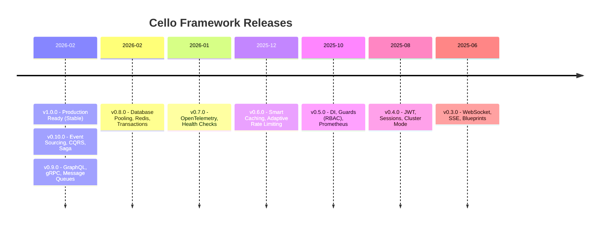

# :material-tag-multiple: Release Notes

---

## :material-new-box: Latest Release -- v1.0.0

!!! success "Cello v1.0.0 -- Production Ready (February 2026)"

    The first **stable release** of Cello is here. The API is frozen under semantic versioning -- no breaking changes until v2.0.

    **Headline features:**

    - :material-check-decagram: **Production Stable** -- finalized public API with semantic versioning guarantees
    - :material-speedometer: **Performance Optimizations** -- handler caching, lazy parsing, zero-copy responses, optimized builds
    - :material-feature-search: **Complete Feature Set** -- everything from routing to Event Sourcing, CQRS, and Saga patterns
    - :material-shield-check: **Enterprise Ready** -- OpenTelemetry, health checks, RBAC, circuit breaker, and more

    [:octicons-arrow-right-24: Full v1.0.0 Release Notes](v1.0.0.md){ .md-button .md-button--primary }
    [:octicons-arrow-right-24: Migration Guide](migration.md#010x-to-10x){ .md-button }

---

## :material-timeline: Version Timeline

Every release of Cello, from the stable 1.0 through the beta series.



---

## :material-history: All Releases

<div class="grid cards" markdown>

-   :material-check-decagram:{ .lg .middle } **v1.0.0** -- Production Ready

    ---

    Stable release with performance optimizations, API stability guarantees, and the complete feature set.

    :material-calendar: February 2026

    [:octicons-arrow-right-24: Release Notes](v1.0.0.md)

-   :material-star-shooting:{ .lg .middle } **v0.10.0** -- Advanced Patterns

    ---

    Event Sourcing, CQRS, and the Saga Pattern for distributed transaction coordination.

    :material-calendar: February 2026

    [:octicons-arrow-right-24: Release Notes](v0.10.0.md)

-   :material-api:{ .lg .middle } **v0.9.0** -- API Protocols

    ---

    GraphQL support, gRPC integration, and message queue adapters for Kafka and RabbitMQ.

    :material-calendar: February 2026

    [:octicons-arrow-right-24: Release Notes](v0.9.0.md)

-   :material-database:{ .lg .middle } **v0.8.0** -- Data Layer

    ---

    Database connection pooling, Redis integration, and transaction support with automatic rollback.

    :material-calendar: February 2026

    [:octicons-arrow-right-24: Release Notes](v0.8.0.md)

-   :material-eye:{ .lg .middle } **v0.7.0** -- Enterprise Observability

    ---

    OpenTelemetry distributed tracing, structured health check endpoints, and enterprise-grade features.

    :material-calendar: January 2026

    [:octicons-arrow-right-24: Release Notes](v0.7.0.md)

-   :material-speedometer:{ .lg .middle } **v0.6.0** -- Smart Middleware

    ---

    Intelligent caching with TTL, adaptive rate limiting based on system load, DTO validation, and circuit breaker.

    :material-calendar: December 2025

    [:octicons-arrow-right-24: Release Notes](v0.6.0.md)

-   :material-shield-check:{ .lg .middle } **v0.5.0** -- Security & DI

    ---

    Dependency injection, composable RBAC guards, Prometheus metrics, and OpenAPI generation.

    :material-calendar: October 2025

    [:octicons-arrow-right-24: Release Notes](v0.5.0.md)

-   :material-lock:{ .lg .middle } **v0.4.0** -- Auth & Sessions

    ---

    JWT authentication, token-bucket rate limiting, secure cookie sessions, security headers, and cluster mode.

    :material-calendar: August 2025

    [:octicons-arrow-right-24: Release Notes](v0.4.0.md)

-   :material-access-point:{ .lg .middle } **v0.3.0** -- Real-time

    ---

    WebSocket support, Server-Sent Events, multipart form handling, and Flask-inspired blueprints.

    :material-calendar: June 2025

    [:octicons-arrow-right-24: Release Notes](v0.3.0.md)

</div>

---

## :material-shield-half-full: Support Policy

| Version | Status | Support Until |
|:--------|:-------|:--------------|
| **1.0.x** | :material-check-circle:{ style="color: #4caf50" } **Active** | Current |
| 0.10.x | :material-wrench:{ style="color: #ffab40" } Maintenance | August 2026 |
| 0.9.x | :material-wrench:{ style="color: #ffab40" } Maintenance | August 2026 |
| 0.8.x | :material-shield-alert:{ style="color: #ff9800" } Security Only | June 2026 |
| < 0.8 | :material-close-circle:{ style="color: #f44336" } End of Life | -- |

!!! info "Version policy"

    Cello follows [Semantic Versioning](https://semver.org/). Starting with **v1.0.0**, the public API is stable -- no breaking changes until v2.0. **Maintenance** releases receive bug fixes. **Security Only** releases receive critical security patches only.

---

## :material-arrow-up-bold-circle: Upgrading

=== "pip"

    ```bash
    # Upgrade to the latest stable release
    pip install --upgrade cello-framework

    # Pin to a specific version
    pip install cello-framework==1.0.0
    ```

=== "requirements.txt"

    ```text
    cello-framework>=1.0.0,<2.0.0
    ```

=== "pyproject.toml"

    ```toml
    [project]
    dependencies = [
        "cello-framework>=1.0.0,<2.0.0",
    ]
    ```

!!! warning "Read the migration guide before upgrading"

    Breaking changes are documented in the [Migration Guide](migration.md). Always review it before bumping a minor version.

---

## :material-file-document-multiple: Additional Resources

<div class="grid cards" markdown>

-   :material-format-list-bulleted:{ .lg .middle } **Full Changelog**

    ---

    Every commit, bug fix, and improvement in one place.

    [:octicons-arrow-right-24: Changelog](changelog.md)

-   :material-directions-fork:{ .lg .middle } **Migration Guide**

    ---

    Step-by-step instructions for upgrading between versions.

    [:octicons-arrow-right-24: Migration Guide](migration.md)

</div>

---

## :material-bell-ring: Stay Updated

- :material-star: [Star the repo on GitHub](https://github.com/jagadeesh32/cello) to show support and get notified
- :material-rss: [Releases RSS Feed](https://github.com/jagadeesh32/cello/releases.atom) for automated notifications
- :fontawesome-brands-discord: [Join Discord](https://discord.gg/cello) for release announcements and discussion
